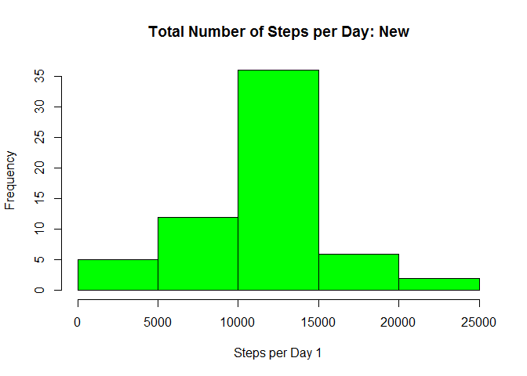

# Reproducible Research: Peer Assessment 1


## Loading and preprocessing the data
First, we will set working directory to RepData_PeerAssessment1.


Let's read the dataset into R:    


```r
path<- paste(getwd(), "activity/activity.csv", sep="/")  

data<-read.csv(path, header=TRUE)  
```
Examine the data:  


```r
str(data)  
```

```
## 'data.frame':	17568 obs. of  3 variables:
##  $ steps   : int  NA NA NA NA NA NA NA NA NA NA ...
##  $ date    : Factor w/ 61 levels "2012-10-01","2012-10-02",..: 1 1 1 1 1 1 1 1 1 1 ...
##  $ interval: int  0 5 10 15 20 25 30 35 40 45 ...
```


Change the class of variable date from "factor" to "date":    


```r
data$date<-as.Date(as.character(data$date))  
```
 
 
Change the class of variable interval to factor:    


```r
data$interval<-as.factor(data$interval)
```

Take a look at the structure of our data again:  


```r
str(data)  
```

```
## 'data.frame':	17568 obs. of  3 variables:
##  $ steps   : int  NA NA NA NA NA NA NA NA NA NA ...
##  $ date    : Date, format: "2012-10-01" "2012-10-01" ...
##  $ interval: Factor w/ 288 levels "0","5","10","15",..: 1 2 3 4 5 6 7 8 9 10 ...
```

## What is mean total number of steps taken per day?  

Calculate a total number of steps per day and build a histogram of the total number of steps taken each day:    


```r
steps_by_day<-tapply(data$steps, data$date, sum, na.rm=TRUE)
hist(steps_by_day, main="Total Number of Steps per Day", col= "red")  
```

 

Calculate and report the mean and median of the total number of steps taken per day:  


```r
summary(steps_by_day) 
```

```
##    Min. 1st Qu.  Median    Mean 3rd Qu.    Max. 
##       0    6778   10400    9354   12810   21190
```


```r
paste("The mean of the total number of steps taken per day is", summary(steps_by_day)[4], sep=":")  
```

```
## [1] "The mean of the total number of steps taken per day is:9354"
```

```r
paste("The median of the total number of steps taken per day is", summary(steps_by_day)[3], sep=":")
```

```
## [1] "The median of the total number of steps taken per day is:10400"
```


## What is the average daily activity pattern?

The average daily activity pattern, calculation and plot:  


```r
step_interval<-aggregate(steps~interval, data, mean, na.rm=TRUE)  
plot(step_interval$steps~step_interval$interval, ylab="average steps", xlab="interval")  
points(step_interval$steps~step_interval$interval, type="l", lwd=2, col="blue", bg="white")  
```

 

Which 5-minute interval contains the maximum number of steps?


```r
maxStepInt<-step_interval$interval[which.max(step_interval$steps)]  
paste("The maximum number of steps is contained in interval", maxStepInt, sep=" ")  
```

```
## [1] "The maximum number of steps is contained in interval 835"
```


## Imputing missing values

Let's take a look at the summary of our data:  


```r
summary(data)  
```

```
##      steps             date               interval    
##  Min.   :  0.00   Min.   :2012-10-01   0      :   61  
##  1st Qu.:  0.00   1st Qu.:2012-10-16   5      :   61  
##  Median :  0.00   Median :2012-10-31   10     :   61  
##  Mean   : 37.38   Mean   :2012-10-31   15     :   61  
##  3rd Qu.: 12.00   3rd Qu.:2012-11-15   20     :   61  
##  Max.   :806.00   Max.   :2012-11-30   25     :   61  
##  NA's   :2304                          (Other):17202
```

From the summary output, we see that the only variable with missing values is steps, and that the total number of missing values is 2,304. Let's double-check:  


```r
sum(is.na(data$steps))  
```

```
## [1] 2304
```

```r
sum(is.na(data$date))  
```

```
## [1] 0
```

```r
sum(is.na(data$interval))  
```

```
## [1] 0
```

To replace missing values, we will use the mean of all steps taken:  


```r
mean(data$steps, na.rm=TRUE)
```

```
## [1] 37.3826
```

To do this, we will need the gam package, which has a function na.gam.replace() that does just that -- replaces a missing value of a numeric variable by the mean of the non-missing values:


```r
require(gam)
```

```
## Loading required package: gam
## Loading required package: splines
## Loaded gam 1.09.1
```

Now, we will create a new dataframe without missing values, using the na.gam.replace() function:  


```r
new<-na.gam.replace(data)  
```

Let's compare a subset of rows of the old dataset (containing missing values) to the corresponding subset of rows of the new dataset to make sure that the missing values have indeed been replaced:  


```r
data[287:290, ]  
```

```
##     steps       date interval
## 287    NA 2012-10-01     2350
## 288    NA 2012-10-01     2355
## 289     0 2012-10-02        0
## 290     0 2012-10-02        5
```

```r
new[287:290, ]  
```

```
##       steps       date interval
## 287 37.3826 2012-10-01     2350
## 288 37.3826 2012-10-01     2355
## 289  0.0000 2012-10-02        0
## 290  0.0000 2012-10-02        5
```

The missing values have been replaced with the average number of all steps.  

Now lets's compare the dimensions of both datasets, to ensure that the new dataset is equal to the original one:  


```r
dim(data)  
```

```
## [1] 17568     3
```

```r
dim(new)  
```

```
## [1] 17568     3
```

From a new dataset, calculate a total number of steps per day and build a histogram of the total number of steps taken each day:    


```r
steps_by_day1<-tapply(new$steps, new$date, sum)
hist(steps_by_day1, main="Total Number of Steps per Day: New", col= "green", xlab="Steps per Day 1")  
```

 

The distributilon of total number of steps per day now looks nearly normal. Let's see if the values of the mean and median will confirm that (they would be the same if that's the case). Calculate and report the mean and median of the total number of steps taken per day:  


```r
summary(steps_by_day1)    
```

```
##    Min. 1st Qu.  Median    Mean 3rd Qu.    Max. 
##      41    9819   10770   10770   12810   21190
```


```r
paste("The mean of the total number of steps taken per day is", summary(steps_by_day1)[4], sep=":")  
```

```
## [1] "The mean of the total number of steps taken per day is:10770"
```

```r
paste("The median of the total number of steps taken per day is", summary(steps_by_day1)[3], sep=":")
```

```
## [1] "The median of the total number of steps taken per day is:10770"
```

Indeed, the mean equals the median in the new distribution of total number of steps per day. We can also compare the summaries of the previously calculated total number of steps by day, and the one from the dataset without missing values side-by-side:  


```r
summary(steps_by_day)  
```

```
##    Min. 1st Qu.  Median    Mean 3rd Qu.    Max. 
##       0    6778   10400    9354   12810   21190
```

```r
summary(steps_by_day1)  
```

```
##    Min. 1st Qu.  Median    Mean 3rd Qu.    Max. 
##      41    9819   10770   10770   12810   21190
```

We can see from the summary outputs that before filling in the missing values, the mean was lower than the median, meaning, we had a left-skewed distribution, whereas after filling in the missing values, the mean and the median are the same, and we have a normal distribution. Both the mean and the median have increased after filling in the missing values.


## Are there differences in activity patterns between weekdays and weekends?

Let's begin by adding a new variable, days of week, to our data and making it a factor variable:


```r
new$daysOfWeek<-weekdays(new$date)  
new$daysOfWeek<-as.factor(new$daysOfWeek)  
```

Using levels() function, we will change the levels to weekday and weekend:  


```r
levels(new$daysOfWeek)  
```

```
## [1] "Friday"    "Monday"    "Saturday"  "Sunday"    "Thursday"  "Tuesday"  
## [7] "Wednesday"
```

```r
levels(new$daysOfWeek)<-c("weekday", "weekday", "weekend", "weekend","weekday", "weekday", "weekday")  
```

```r
levels(new$daysOfWeek)
```

```
## [1] "weekday" "weekend"
```

Now we can create a new dataset with the average number of steps taken, split by intervals and days of week:  


```r
library(plyr)  
```

```r
ave_new_data<-ddply(new, .(interval, daysOfWeek), summarise, steps=mean(steps))  
```

And finally, we will create a panel plot of the average number of steps taken vs. the 5-minute interval, averaged across all weekday days or weekend days. To do so, we will use the lattice package:    


```r
library(lattice)  
```

```r
xyplot(steps~interval|daysOfWeek, ave_new_data, xlab="Interval", ylab="Number of Steps", type="l", layout=c(1,2))  
```

 

